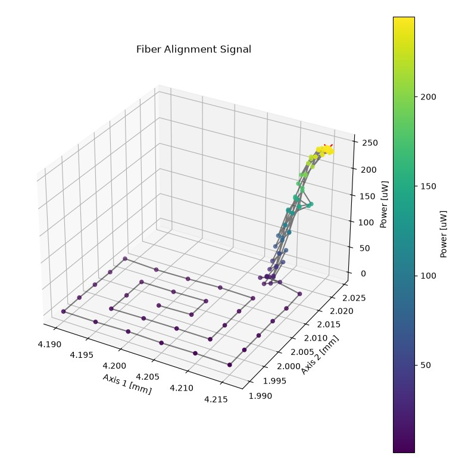

# Automated Fiber Alignment Routines

*By Jay Leong*

This repository contains code to perform 2-axis optical fiber alignment with Zaber stages and an optical power meter that is capable to outputing an analog signal as a power feedback. Algorithms described in the article are implemented in Python, along with classes allowing them to be easily used with Zaber stages via the [Zaber Motion Library](https://software.zaber.com/motion-library/api/py) API.



## Hardware Requirements

This code is designed to run on devices with [Zaber](https://www.zaber.com/) controllers.

Notes:

- [fiber_alignment_demo.py](fiber_alignment_demo.py) is written for two zaber axes controlled by a single Zaber controller with the power meter signal connected to an analog input on the same controller. The code can be adapted for setups with multiple controllers but some methods may not be compatible.
- The `streamed_spiral_scan` method in the `FiberAlignment2D` class is only compatible when the motion devices and power meter analog input are all connected to the same controller since it requires synchronized motion and inputs.

## Dependencies / Software Requirements / Prerequisites

The script uses `uv` to manage virtual environment and dependencies:

```bash
pip install uv
```

The dependencies are listed in `pyproject.toml`.

## Usage

[fiber_alignment_2d.py](fiber_alignment_2d.py) is designed to be imported and reused in other programs rather than being run directly.
[fiber_alignment_demo.py](fiber_alignment_demo.py) is provided to demonstrate the usage of the classes in `fiber_alignment_2d.py`.

`fiber_alignment_2d.py` contains several methods for performing fiber alignment. The ideal choice will depend on the system and application it is being used for. Details on the purpose and benefits of each method are provided below in the [FiberAlignment2D Class](#fiberalignment2d-class) section.

## Demo Script

### Configuration / Parameters

Edit the script settings in [fiber_alignment_demo.py](fiber_alignment_demo.py) to fit your setup before running the script.

`SERIAL_PORT` is the serial port that your Zaber device is connected to.
For more information on how to identify the serial port,
see [Find the right serial port name](https://software.zaber.com/motion-library/docs/guides/communication/find_right_port).

### Running the Script

To run the example code:

```bash
uv sync
uv run fiber_alignment_demo.py
```

## FiberAlignment2D Class

Importing the class (Python):

```python
from fiber_alignment_2d import DeviceAnalogInput, FiberAlignment2D, AlignmentResult, AlignmentSamples
```

Initialization (Python):

```python
analog_input = DeviceAnalogInput(zaber_device, analog_input_number, gain, num_samples)
fiber_alignment = FiberAlignment2D(zaber_axis_1, zaber_axis_2, analog_input)
```

- The `zaber_axis_1` and `zaber_axis_2` parameters are the [`Axis`](https://software.zaber.com/motion-library/api/py/ascii/axis) class instances that the `FiberAlignment2D` class will move to maximize analog input signal during alignment.
- The `analog_input` parameter is an instance of the `DeviceAnalogInput` class which defines the analog input used for the power meter.
  - The `zaber_device` parameter is the [`Device`](https://software.zaber.com/motion-library/api/py/ascii/device) class instance that contains the analog input.
  - The `analog_input_number` parameter specifies which analog input pin the power meter is connected to.
  - The `gain` parameter is a gain factor for converting the analog input voltage to power units. This parameter is optional and defaults to 1.
  - The `num_samples` parameter specifies how many samples to take and average when calling the `get_signal` method to reduce noise. This parameter is optional and defaults to 1.

### First-Light Search Methods

These methods are used to scan for an initial signal strong enough to reliably to use a hill climb optimization routine.

#### raster_scan()

Performs a point-by-point raster scan of a square centered on the current position starting at one corner. The `search_distance` parameter defines the size of the square search area and the `resolution` parameter defines the step size between points.

This is useful for covering a large area if `zaber_axis_2` is faster than `zaber_axis_1` since the slow axis can remain stationary during each line scan.

This method stops when the signal exceeds `first_light_threshold` by default. If it is necessary to scan the entire area in order to map the signal in the space or find a global maximum, set the `stop_at_threshold` option to `False` which will allow the scan to complete and then move to the position with the highest signal.

#### spiral_scan()

This method is similar to `raster_scan()` but performs a square spiral starting at the current position and spirals outwards. This is typically more efficient than a raster scan if the initial position is already roughly aligned.

#### streamed_spiral_scan()

This methods performs a constant velocity circular spiral motion starting at the current position using [streams](https://software.zaber.com/motion-library/api/py/ascii/device#streams) and uses [triggers](https://software.zaber.com/motion-library/api/py/ascii/device#triggers) to stop when a signal is detected. This method is faster than `spiral_scan()` since it is continously moving and monitoring the signal at high freqeuncy but can be less reliable if the power meter response is not fast enough or there is signal noise.

When `trigger_threshold` is exceeded, the current position is recorded and motion is stopped. After coming to a stop, the stages move back to the position recorded by the trigger, retakes the measurement, and compares it to `first_light_threshold` to ensure that the final signal is above the required threshold. The triggers can take up to a few milliseconds to record the position resulting in some error. `trigger_threshold` must be higher than `first_light_threshold` to account for this as well as other sources of error and noise.

The recorded position is read from the axis setting specified by the `trigger_position_setting` property in `FiberAlignment2D`. By default, [`encoder.pos`](https://www.zaber.com/protocol-manual?protocol=ASCII#topic_setting_encoder_pos) will be used if the stages have built in encoders and [`pos`](https://www.zaber.com/protocol-manual?protocol=ASCII#topic_setting_pos) will be used otherwise.

Reliability can be improved by reducing the speed and acceleration. To change the max speed or acceleration used during streamed motion use the `set_stream_max_speed` and `set_stream_max_accel` methods in the instance of `FiberAlignment2D`.

If the scan is reliably detecting first-light but the system is not returning to that position accurately enough to get a signal above `first_light_threshold`, an alternative to slowing down the streamed motion is to perform a `spiral_scan()` afterwards. This combination would make use of `streamed_spiral_scan()` to quickly get close to a position where first-light can be detected and then use the slower but more reliable `spiral_scan()` find the first-light signal again.

### Hill Climb Optimization Methods

These methods optimize position to maximize the signal strength. Simple examples of a pattern search and gradient search are provided but more complex and efficient methods are also possible. These methods can also be extended to work with more axes simultaneously.

#### pattern_search()

The [pattern search](https://en.wikipedia.org/wiki/Pattern_search_(optimization)) algorithm takes a positive and negative step with each axis and moves to the position with the highest signal. When no improvement is found, it halves the step size and repeats the process. The search iterates this process until the step size is `min_step` or `max_iterations` is reached.

#### gradient_search()

This search algorithm takes a step on each axis to calculate the gradient and takes a step in the direction of the gradient. When no improvement is found, it halves the step size and repeats the process. The search iterates this process until the step size is `min_step` or `max_iterations` is reached.

This method is more complex and sensitive to noise but can be faster than the `pattern_search()` because it requires fewer measurements per iteration and can move diagonally.

## Troubleshooting Tips

- If you encounter an error when running one of the example scripts, check the Serial Port number (ex. COM5) using [Zaber Launcher](https://zaber.com/zaber-launcher#download).
